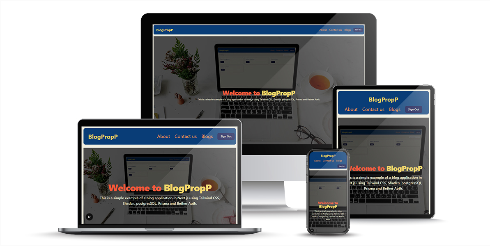

# 📖 Bloggprojekt – Next.js, Prisma & Tailwind



Detta är ett **bloggprojekt** byggt med **Next.js (App Router)**, **Prisma ORM**, **PostgreSQL** och **Better Auth**.  


---

## 🚀 Teknologier

- [Next.js](https://nextjs.org/) – React-ramverk med App Router
- [Prisma](https://www.prisma.io/) – ORM för databas
- [PostgreSQL](https://www.postgresql.org/) – Databas
- [Better Auth](https://www.better-auth.com/) – Autentisering
- [Tailwind CSS](https://tailwindcss.com/) – Styling
- TypeScript

---

## 📂 Filstruktur

```bash
├── prisma
│   └── schema.prisma          # Prisma schema för databas
├── public
│   └── images
│       ├── hero.jpg
│       └── mockup-blogpropp.jpg
├── src
│   ├── app
│   │   ├── about
│   │   │   ├── contact
│   │   │   └── page.tsx
│   │   ├── api
│   │   │   └── auth/[...all]/route.ts
│   │   ├── blog
│   │   │   ├── [blogId]
│   │   │   │   ├── edit
│   │   │   │   │   ├── actions.ts
│   │   │   │   │   ├── form.tsx
│   │   │   │   │   ├── page.tsx
│   │   │   │   │   └── schema.ts
│   │   │   │   ├── actions.ts
│   │   │   │   ├── back-button.tsx
│   │   │   │   ├── delete-button.tsx
│   │   │   │   └── page.tsx
│   │   │   ├── create
│   │   │   │   ├── actions.ts
│   │   │   │   ├── form.tsx
│   │   │   │   ├── page.tsx
│   │   │   │   └── schema.ts
│   │   │   ├── layout.tsx
│   │   │   └── page.tsx
│   │   ├── sign-in
│   │   │   ├── form.tsx
│   │   │   └── page.tsx
│   │   ├── sign-up
│   │   │   ├── form.tsx
│   │   │   └── page.tsx
│   │   ├── globals.css
│   │   ├── layout.tsx
│   │   └── page.tsx
│   ├── components
│   │   ├── ui
│   │   │   ├── button.tsx
│   │   │   ├── card.tsx
│   │   │   ├── form.tsx
│   │   │   ├── input.tsx
│   │   │   └── label.tsx
│   │   ├── blog-navbar.tsx
│   │   └── nav-user.tsx
│   ├── lib
│   │   ├── auth-client.ts
│   │   ├── auth.ts
│   │   ├── prisma.ts
│   │   └── utils.ts
│   └── generated
├── .env
├── .gitignore
├── components.json
├── eslint.config.mjs
├── next-env.d.ts
├── next.config.ts
├── package-lock.json
├── package.json
├── postcss.config.mjs
├── README.md
└── tsconfig.json
## ⚙️ Installation (Windows PowerShell)

1. Klona projektet

```powershell
git clone https://github.com/<ditt-användarnamn>/blogpropp.git
cd blogpropp
```

2. Installera beroenden

# BlogPropp

BlogPropp is a small demo blog application built with Next.js (App Router), Prisma, PostgreSQL, Better Auth and Tailwind CSS. I created this project while learning Better Auth and to explore how authentication and CRUD flows integrate with Prisma and Next.js.

This README is intentionally short — it includes only the essentials to get the project running locally.
---

## Features

- Email & password authentication (Better Auth)
- Create, read, update, delete blog posts (CRUD)
- Prisma for database access
- Tailwind CSS for styling
---

## Tech stack

- Next.js (App Router)
- Prisma (PostgreSQL)
- Better Auth
- Tailwind CSS
- TypeScript

---

## Quick start (Windows PowerShell)

Prerequisites: Node.js (18+), npm, and a PostgreSQL instance. For quick testing you can use SQLite by setting `DATABASE_URL` accordingly.

1. Clone the repo and install dependencies

```powershell
git clone https://github.com/<your-username>/blogpropp.git
cd blogpropp
npm install
```

2. Create a `.env` file from the example and update values

```powershell
copy .env.example .env
# Edit .env and set DATABASE_URL and the auth secrets
```

3. Generate Prisma client, run migrations and seed the database

```powershell
npm run prisma:generate
npm run migrate
npm run seed
```

4. Start the dev server

```powershell
npm run dev
```

Open http://localhost:3000 in your browser.
---

## Environment variables

- `DATABASE_URL` — your database connection string (Postgres recommended)
- `BETTER_AUTH_SECRET`, `AUTH_SECRET`, `NEXTAUTH_SECRET`, `JWT_SECRET` — long random secrets used for signing sessions/auth tokens

See `.env.example` for an example.
---

## Database

Prisma is used for database access. The schema is in `prisma/schema.prisma`. Use the provided scripts:

- `npm run migrate` — runs `prisma migrate dev`
- `npm run seed` — runs `prisma/seed.ts` to populate demo data
---


## Development notes

- Sign-up and sign-in pages use the Better Auth client pointed at `/api/auth`.
- Protected pages verify sessions on the server via `auth.api.getSession`.

If you'd like further polish (UI, tests, CI, deployment), tell me which area to prioritize and I can implement it.

---

## Contributing

Contributions are welcome. Fork, create a branch, and open a pull request with a clear description.

---

## License

This project is available under the MIT License.
